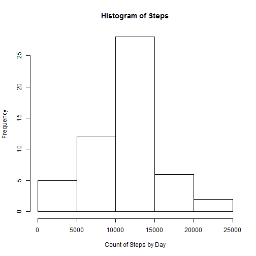
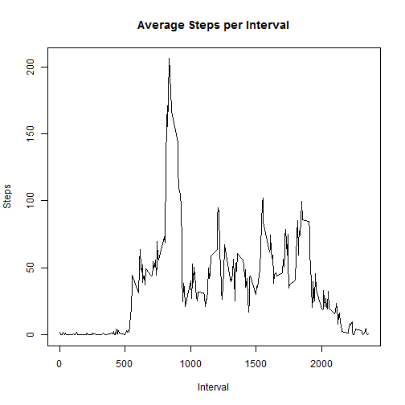
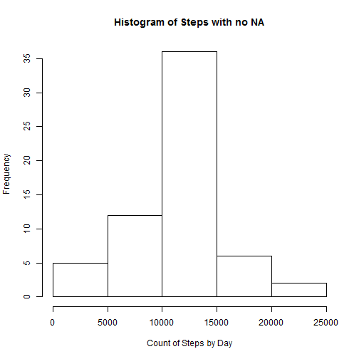
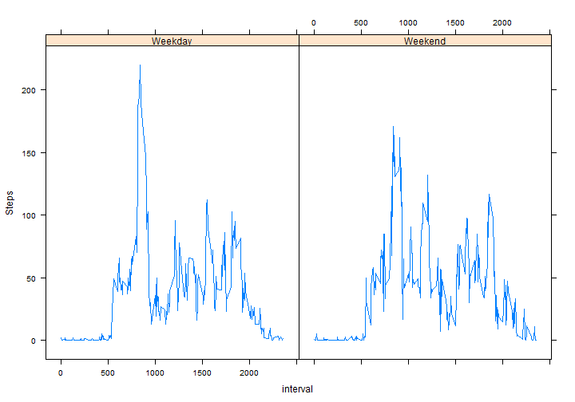

# Reproducible Research: Peer Assessment 1
Rick Walsh   6/10/2014

Load libraries for sqlds, and lattice plots to start.


```r
library(sqldf)
```

```
## Loading required package: gsubfn
## Loading required package: proto
## Loading required package: RSQLite
## Loading required package: DBI
## Loading required package: RSQLite.extfuns
```

```r
library(lattice)
```

## Loading and preprocessing the data

First, load and transform the data, so read.csv into df,
then use sqldf to return the not null step values
grouped by date


```r
Activity <- read.csv("activity.csv", colClasses = c("numeric", "Date", "numeric"))

dateSum<-sqldf('select sum(steps) as Steps from Activity where steps is not null group by date ')
```

```
## Loading required package: tcltk
```

## What is the mean total number of steps taken per day?

Display a histogram of the step data.  SQL above eliminates 
any NA values from consideration. Also determine mean and median 
of steps per day


```r
hist(dateSum$Steps,  xlab='Count of Steps by Day', main="Histogram of Steps")
```

 

Display median followed by mean.


```r
median(dateSum$Steps)
```

```
## [1] 10765
```

```r
mean(dateSum$Steps)
```

```
## [1] 10766
```

## What is the average daily activity pattern?

We need average the steps taken per 5 minute interval across all days.

SQL below provides a df with step count, grouped by interval in a df.
SQL divides sum by count for an average value per interval.

Once determined, create a time series plot of average step count per interval.


```r
timeSum<-sqldf('select interval, sum(steps) / count(*) as AvgSteps from Activity where steps is not null group by interval order by interval  ')

plot(timeSum, ylab="Steps", xlab="Interval", main="Average Steps per Interval",type = "l")
```

 

## Determine 5 minute interval with maximum number of steps across all days.

SQL will order with highest number first per DESC keyword.
Then display the max steps info, max interval is 835, with step count 10927


```r
maxSteps <-sqldf('select interval, sum(steps) as Steps from Activity where steps is not null group by interval order by Steps desc  ')
```

Display maximum interval, and steps in that interval.


```r
maxSteps$interval[1]
```

```
## [1] 835
```

```r
maxSteps$Steps[1]
```

```
## [1] 10927
```

## Imputing Missing Values

Find the count of NA values, which is 2304


```r
naList <-sqldf('select count(*) as NASteps from Activity where steps is null   ')
naList
```

```
##   NASteps
## 1    2304
```

### Fill in Missing Data.

Strategy is to iterate through the data set, and for each NA, assume 
the average of that interval and update the dataset with that value.

In the For loop, extract the interval, subset on df with average 
value for that interval and set the number of steps to that average value.


```r
for (i in 1:nrow(Activity))
{
  if (is.na(Activity$steps[i])) {
    tInterval <- Activity$interval[i]
    ttimeSum <- subset(timeSum, interval==tInterval)
    Activity$steps[i] <- ttimeSum$AvgSteps
  }
}
```

### Create new dataset with missing data filled in.

Activity df now has no NA's, so write it out to disk, then 
read it back for processing.


```r
write.csv(Activity, file = "ActivityImpute.csv",   row.names=FALSE)

# read the data into new df
ActivityImpute <- read.csv("ActivityImpute.csv", 
            colClasses = c("numeric", "Date", "numeric"))
```

### Using new dataset, create Histogram and report mean and median.

Uses SQLdf to return the step values (no longer any NA's), grouped by date
then display in Histogram, report mean and median.


```r
dateSum<-sqldf('select sum(steps) as Steps from ActivityImpute group by date ')

hist(dateSum$Steps, xlab='Count of Steps by Day', main="Histogram of Steps with no NA")
```

 

Report median, followed by mean.


```r
median(dateSum$Steps)
```

```
## [1] 10766
```

```r
mean(dateSum$Steps)
```

```
## [1] 10766
```

## Are there differences in Activity Patterns between Weekdays and Weekends?

Use sqldf for transformation. 
Use vector and POSIX function to create Weekday/Weekend factor, then
merge new data set with weekend/weekday df, to create new df for processing.


```r
wd = c("Weekend","Weekend","Weekday","Weekday","Weekday","Weekday","Weekday")

# select the dates from the file for the weekday calculation  
dateList<-sqldf('select distinct (date), " " as weekday from ActivityImpute order by date ')

# iterate through list of dates, get the 0-6 and add 1 to map as 1-7
# then use the vector above to set as weekday or weekend in the df
for(i in 1:nrow(dateList)){
  dateList$weekday[i] <- wd[as.POSIXlt(dateList$date[i])$wday+1]
}

# now merge the Activity data set with the dateList
# so my new data set has weekday/weekend included
wdActivity <- merge(ActivityImpute, dateList, by="date")
```

### Make a Panel Plot of 5 minute interval data by weekend/weekday. 

Select data using SQLDF with no NA's, then xyplot by weekend/weekday.


```r
wkSteps <-sqldf('select interval, weekday, sum(steps) / count(*) as Steps from wdActivity group by interval, weekday ')

xyplot(Steps ~ interval | weekday, wkSteps,  type = "l" )
```

 
